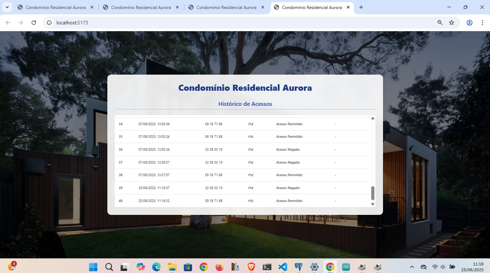

# Relatório de Projeto P3: Sistema de Controle de Acesso IoT para o Condomínio Residencial Aurora

**Aluno(s):** André Flávio de Oliveira, Mauro do Prado Santos\
**Disciplina:** Internet das Coisas e Aplicações\
**Professor:** Henrique Louro\
**Instituição:** Faculdade de Tecnologia Professor Francisco de Moura - FATEC Jacareí\
**Data:** 25 de junho de 2025\

---

### 1. Descrição Geral da Aplicação

O projeto "Condomínio Residencial Aurora" é um sistema de controle de acesso que utiliza uma placa Arduino Uno como unidade central de processamento. A solução foi aprimorada para se tornar uma aplicação de Internet das Coisas (IoT) completa, com a adição de um módulo Wi-Fi ESP-01. O sistema gerencia o acesso através de duas formas de autenticação: cartões de proximidade, lidos por um módulo RFID RC522, e senhas numéricas inseridas em um teclado sensível ao toque TTP224.

O Arduino é responsável por ler os sensores, validar as credenciais e, em seguida, transmitir os dados do evento (UID do cartão, data, hora, tipo de acesso e status) via comunicação serial para o módulo ESP-01. O ESP-01, por sua vez, estabelece conexão com uma rede Wi-Fi e envia essas informações para um servidor backend Node.js. Este servidor processa e armazena os registros em um banco de dados PostgreSQL. Para o monitoramento, uma aplicação web com front-end em TypeScript exibe em tempo real o histórico detalhado dos acessos.

### 2. Melhorias Implementadas na Versão 2 (P3)

A evolução do projeto da P2 para a P3 foi focada em adicionar conectividade e criar uma arquitetura de software robusta, transformando o protótipo local em uma solução IoT.

* **Adição de Conectividade Wi-Fi:** A principal melhoria foi a integração de um módulo Wi-Fi ESP-01 ao circuito. O Arduino Uno continua sendo o cérebro da operação, mas agora delega a função de comunicação com a internet ao ESP-01, enviando os dados a serem transmitidos via serial.
* **Implementação de Arquitetura Web Completa:** O script Python que dependia de uma conexão física com o computador foi substituído por uma solução cliente-servidor muito mais escalável.
* **Backend:** Foi desenvolvido um servidor em Node.js com TypeScript, que expõe uma API para receber os dados do ESP-01 via requisições HTTP e os insere no banco de dados PostgreSQL.
* **Frontend:** Foi criada uma interface web (dashboard) com TypeScript, que consome os dados do backend e os exibe em uma tabela, permitindo o monitoramento remoto dos acessos em tempo real.
* **Estrutura de Dados Aprimorada:** O sistema passou a registrar um conjunto mais rico de informações para cada evento, incluindo: ID do registro, UID da tag, data e hora, tipo de acesso (RFID ou senha) e uma mensagem de status (acesso permitido ou negado).
* **Remoção do Atuador Físico:** O servo motor SG90 foi retirado do projeto. A remoção permitiu focar os esforços no desenvolvimento da conectividade e na plataforma de software, que são o núcleo desta nova fase do projeto.

### 3. Desenho da Arquitetura da Solução

A arquitetura foi reestruturada para refletir a comunicação em etapas: do hardware para a nuvem e, finalmente, para o usuário.

### 4. Relação de Material e Software

**Hardware e Periféricos:**

* **Microcontrolador:** Placa Arduino Uno.
* **Módulo de Conectividade:** Módulo Wi-Fi ESP-01.
* **Leitor RFID:** Módulo MFRC522 com tags/cartões de 13.56MHz.
* **Entrada de Senha:** Módulo Sensor Touch Capacitivo TTP224 (4 vias).
* **Montagem:** Protoboard e cabos jumpers.

**Software, Pacotes e Plataformas:**

* **Firmware (Embarcado):**
    * **IDE:** Arduino IDE.
    * **Linguagem:** C/C++.
    * **Bibliotecas Arduino:** `SPI`, `MFRC522`, `SoftwareSerial`.
* **Backend:**
    * **Plataforma:** Node.js.
    * **Linguagem:** TypeScript.
    * **Framework:** Express.js.
    * **Driver Banco de Dados:** `pg` (node-postgres).
* **Frontend:**
    * **Linguagem:** TypeScript.
    * **Framework:** React, Angular ou Vue.js.
* **Banco de Dados:**
    * **SGBD:** PostgreSQL.

### 5. Desenho de Conexão do Circuito de Hardware

As conexões dos módulos à placa Arduino Uno seguem o esquema abaixo, conforme o diagrama fornecido.

**Módulo Wi-Fi (ESP-01)**
| Pino do ESP-01      | Pino do Arduino Uno          |
| ------------------- | ---------------------------- |
| 3V3                 | 3.3V                         |
| RX                  | 3 (Arduino RX via SoftwareSerial) |
| EN                  | 3.3V (ou pino digital HIGH)  |
| TX                  | 2 (Arduino TX via SoftwareSerial) |
| GND                 | GND                          |

**Módulo RFID (RC522)**
| Pino do RC522 | Pino do Arduino Uno |
| ------------- | ------------------- |
| SDA           | 10                  |
| SCK           | 13                  |
| MOSI          | 11                  |
| MISO          | 12                  |
| RST           | 9                   |
| GND           | GND                 |
| 3.3V          | 3.3V                |

**Módulo Touch (TTP224)**
| Pino do Módulo Touch | Pino do Arduino Uno |
| -------------------- | ------------------- |
| out1                 | 5                   |
| out2                 | 6                   |
| out3                 | 7                   |
| out4                 | 8                   |
| GND                  | GND                 |
| VCC                  | 5V                  |

### 6. Repositório do Código Fonte

Todo o código fonte desenvolvido para este projeto, incluindo o firmware do Arduino e os componentes de backend e frontend, está disponível no seguinte repositório do GitHub:

* **URL:** `https://github.com/omaurosantos/4dsm/tree/main/InternetDasCoisas/servidor-condominio`

### 7. Manual de Uso

**Para o Usuário (Morador):**

1.  **Acesso com Cartão RFID:** Aproxime um cartão RFID cadastrado do leitor RC522. O LED indicará a leitura e o sistema registrará o evento.
2.  **Acesso com Senha:** Toque a sequência numérica correta nos sensores do módulo TTP224.

**Para o Administrador (Monitoramento):**

1.  **Acessar o Dashboard:** Em um navegador web, acesse o endereço da aplicação frontend (ex: `http://localhost:3000`).
2.  **Visualizar os Registros:** A tela principal exibirá a lista de todos os eventos de acesso, contendo ID, UID (quando aplicável), data e hora, tipo de acesso e o status (permitido ou negado).

### 8. Telas de Visualização do Sistema

*(Substitua as imagens abaixo por capturas de tela reais da sua aplicação.)*

**Exemplo de Tabela de Registros no Dashboard:**

*Figura 1: Tela principal do dashboard, exibindo o histórico de acessos com detalhes sobre UID, data, tipo e status.*
